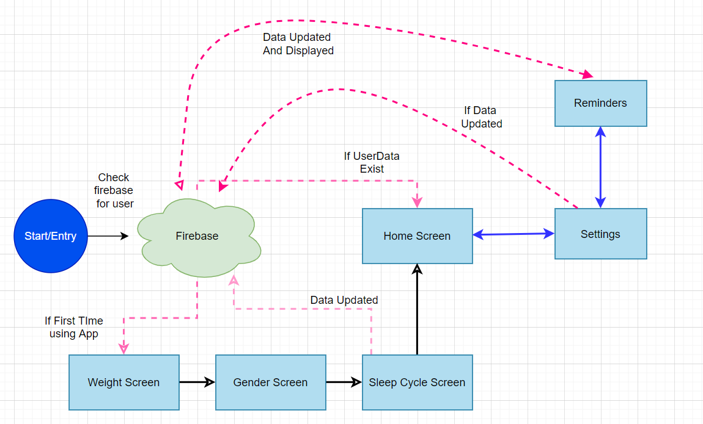

# Water Reminder App
  Flutter application which calculates and keeps track of your daily water intake.

## Use Cases and Description
 

### Onboarding Setup 
Application should ask the user for his weight, gender and sleep cycle when user runs app for first time. And store this in firebase for later use.
And it should also check that the values for weight,and sleep cycle are valid.

### WaterGoal
Application should calculate the ideal water intake based on the users gender and weight and display that as a goal.

###  Add 250ml water glass 
Application should allow user to increase his current water drunk with a press of a button.

### Edit time of Intake
Application should allow the user to open a popup menu to edit the time of the water intake.

### Delete Intake Record
Application should allow the user to delete a water record. And reduce the water drunk

### Visual Progress towards Goal 
Application should display a progress idicater bar which grows with each glass of water drunk 

### View Information
Application should have a seperate settings page which should display the users personal information

### Edit Information
This settings page should allow the users to edit his personal information

### Display Reminders
Application should allow the user to view his current water reminders, and their status with a press of a button.

### Edit reminders
Application should allow the user to edit the time and status(Enabled/Disabled) of the reminders.

### Generate Dynamic Reminders
The Application should generate reminders according to the water intake goal and the sleep cycle of the user when the user fill the app with his data.

### Delete Reminders
The Application should allow the user to delete the generated reminders.

### Create Reminder
The Applicatoin should allow the user to create a reminder of his chosen time with a press of a button.

### Notification
When a reminder is enabled, it should display a notification to the user when the time is reached.

## Video defining the use cases one by one

